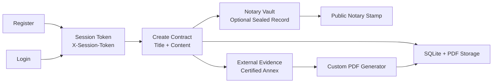

# SignMeMaybe (Contract Signing Service)

SignMeMaybe is a small contract signing and archive service for attack/defense CTF testing. Users can register, log in, create contract records, list their own contracts, inspect public holder metadata, retrieve latest versions, and open generated certified PDFs.

The service also models a notary vault. A contract may have a public notary stamp proving that a private sealed record exists. The sealed record is stored outside normal contract content in a file-backed notary vault. Certified PDFs may include external evidence attachments declared in contract markup.

-----------------------------------------------

## Usage

Start the service:

```bash
cd service
docker compose up --build
```

Stop the service:

```bash
cd service
docker compose down
```

Start the checker:

```bash
cd checker
docker compose up --build
```

The service is available at:

```text
http://localhost:1984
```

The local checker web UI is available at:

```text
http://localhost:11984/docs/
```

## Project Structure

- `README.md`: Overview of the service, usage, design, and architecture.
- `documentation/README.md`: Detailed description of flag storage, vulnerability behavior, and exploit path.
- `documentation/AGENTS.md`: Local agent/project conventions; ignored by git.
- `service/`: ASP.NET Core service, Docker setup, cleanup cron container, and persisted service data.
- `service/src/`: Main `.NET 10` application source code.
- `checker/`: Python `enochecker3` checker, Docker setup, and checker state storage.

## Design



The checker uses two flag stores. Vulnerability `0` stores flags in ordinary contract content and relies on the permissive latest-version/latest-PDF routes. Public holder metadata does not expose raw `CNTR-...` references, but it does expose titles and checksums; new contract references prefer `CNTR-` plus the first 24 hex characters of `sha256(username + ":" + title + ":" + checksum)`. Vulnerability `1` stores flags as sealed notary records outside normal contract content.

The latest-version and latest-PDF routes still accept any valid session plus a public `CNTR-...` reference. For notary-backed records, public metadata exposes only the notary stamp, and the intended exploit uses certified PDF external evidence fetching and PDF embedded files.

### Service

The service is an ASP.NET Core `.NET 10` web application bound to port `1984`.

Important API endpoints include:

- `GET /`: Browser portal for users.
- `GET /health`: Health endpoint used by the checker.
- `GET /api/info`: Basic service metadata.
- `POST /api/register`: Creates a user and returns a session token.
- `POST /api/login`: Authenticates a user and returns a session token.
- `GET /api/me`: Returns the authenticated user.
- `POST /api/contracts`: Creates a contract and optional notary sealed record.
- `GET /api/contracts`: Lists contracts owned by the authenticated user, including public notary stamps.
- `GET /api/users/{username}/contracts`: Lists public contract metadata for a holder username, including checksums and public notary stamps, but not raw contract references.
- `GET /api/contracts/{reference}/notary/sealed`: Returns the sealed record to the owning user.
- `GET /api/contracts/{reference}/versions/latest`: Returns the latest contract version.
- `GET /api/contracts/{reference}/versions/latest/pdf`: Returns the generated PDF for the latest version.
- `GET /api/links/leave?to=<url>`: Compatibility redirect for external evidence links.

Authentication uses random session tokens sent via the `X-Session-Token` HTTP header.

Runtime storage defaults:

- `SIGNMEMAYBE_DB_PATH=/data/signmemaybe.sqlite3`
- `SIGNMEMAYBE_PDF_ROOT=/data/pdfs`
- `SIGNMEMAYBE_EXPORT_ROOT=/data/exports`
- `SIGNMEMAYBE_NOTARY_VAULT_ROOT=/data/notary-vault`
- `SIGNMEMAYBE_MAX_UPLOAD_BYTES=10485760`
- `SIGNMEMAYBE_CLEANUP_RETENTION_SECONDS=720`

`service/docker-compose.yml` also starts a `signmemaybe-cleanup` container. It runs once per minute and calls cleanup mode to remove old sessions, contracts, generated PDFs, exports, and notary vault files. Cleanup is opportunistic: if SQLite is missing or busy, that tick exits successfully and retries later.

Run one cleanup pass without Docker:

```bash
SIGNMEMAYBE_DB_PATH=/tmp/signmemaybe-smoke.sqlite3 SIGNMEMAYBE_PDF_ROOT=/tmp/signmemaybe-smoke-pdfs SIGNMEMAYBE_EXPORT_ROOT=/tmp/signmemaybe-smoke-exports SIGNMEMAYBE_NOTARY_VAULT_ROOT=/tmp/signmemaybe-smoke-notary-vault SIGNMEMAYBE_CLEANUP_RETENTION_SECONDS=720 dotnet run --project service/src/SignMeMaybe.csproj -- --cleanup-once
```

### Checker

The checker uses `enochecker3` and runs through Gunicorn/Uvicorn on local port `11984`. A MongoDB container stores checker state such as generated credentials, contract references, and notary stamps.

Checker behavior:

- **`putflag/getflag` vuln 0**: Registers a user, creates an ordinary contract containing the flag plus three ordinary decoy contracts, verifies owner retrieval, and checks that public metadata exposes only the title/checksum pair needed to derive candidate references.
- **`putflag/getflag` vuln 1**: Registers a user, creates a normal-looking contract, stores the flag in `notarySecret`, saves the `notaryStamp`, and verifies the owner-only sealed record endpoint.
- **`putnoise/getnoise`**: Creates ordinary title/content contracts and verifies login, `/api/me`, owner listing, public metadata, latest JSON, and generated PDFs.
- **`havoc`**: Performs stateless health and rejection checks.
- **`exploit` vuln 0**: Resolves public metadata by username, derives candidate `CNTR-{sha256(username + ":" + title + ":" + checksum)[:24]}` references for all public contracts, and reads latest JSON/PDF through the IDOR.
- **`exploit` vuln 1**: Resolves a public notary stamp, creates an attacker contract with a certified annex directive, downloads the attacker PDF, and recovers the sealed record from embedded file bytes.

Run the local checker test after starting service and checker:

```bash
ENOCHECKER_SERVICE_ADDRESS="{host-ip-address}" ENOCHECKER_CHECKER_PORT=11984 ENOCHECKER_TEST_CHECKER_ADDRESS="localhost" enochecker_test
```

`enochecker_test` can be installed if missing:

```bash
python3 -m pip install enochecker_test --break-system-packages
```

## Local Smoke Test

Start the service with temporary storage:

```bash
SIGNMEMAYBE_DB_PATH=/tmp/signmemaybe-smoke.sqlite3 SIGNMEMAYBE_PDF_ROOT=/tmp/signmemaybe-smoke-pdfs SIGNMEMAYBE_EXPORT_ROOT=/tmp/signmemaybe-smoke-exports SIGNMEMAYBE_NOTARY_VAULT_ROOT=/tmp/signmemaybe-smoke-notary-vault dotnet run --project service/src/SignMeMaybe.csproj --urls http://127.0.0.1:51989
```

Register a user, create an ordinary contract, then create a notary-backed contract:

```bash
curl -sS -X POST http://127.0.0.1:51989/api/register -H 'Content-Type: application/json' -d '{"username":"smoke_user","password":"password123"}'
curl -sS -X POST http://127.0.0.1:51989/api/contracts -H 'Content-Type: application/json' -H 'X-Session-Token: <TOKEN>' -d '{"title":"Smoke","content":"ordinary contract text"}'
curl -sS -X POST http://127.0.0.1:51989/api/contracts -H 'Content-Type: application/json' -H 'X-Session-Token: <TOKEN>' -d '{"title":"Certified package","content":"public contract text","notarySecret":"ENOAAAAAAAAAAAAAAAAAAAAAAAAAAAAAAAAAAAAAAAAAAAAAAAA"}'
```

Fetch latest JSON, latest PDF, and the owner-only sealed record:

```bash
curl -sS http://127.0.0.1:51989/api/contracts/<REFERENCE>/versions/latest -H 'X-Session-Token: <TOKEN>'
curl -sS http://127.0.0.1:51989/api/contracts/<REFERENCE>/versions/latest/pdf -H 'X-Session-Token: <TOKEN>' -o /tmp/signmemaybe-smoke.pdf
curl -sS http://127.0.0.1:51989/api/contracts/<REFERENCE>/notary/sealed -H 'X-Session-Token: <TOKEN>'
```

For cleanup testing:

```bash
SIGNMEMAYBE_DB_PATH=/tmp/signmemaybe-smoke.sqlite3 SIGNMEMAYBE_PDF_ROOT=/tmp/signmemaybe-smoke-pdfs SIGNMEMAYBE_EXPORT_ROOT=/tmp/signmemaybe-smoke-exports SIGNMEMAYBE_NOTARY_VAULT_ROOT=/tmp/signmemaybe-smoke-notary-vault SIGNMEMAYBE_CLEANUP_RETENTION_SECONDS=1 dotnet run --project service/src/SignMeMaybe.csproj -- --cleanup-once
```

## Troubleshooting

If checker logs show `OfflineException: Could not connect to service`, inspect service logs for SQLite lock errors. The service uses WAL mode, a per-connection busy timeout, and cleanup skips busy database ticks.
