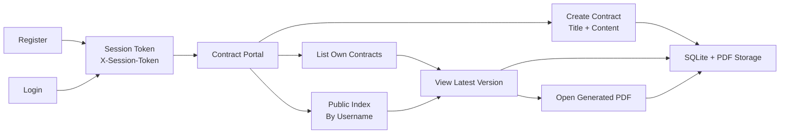

# SignMeMaybe (Contract Signing Service)

SignMeMaybe is a small contract signing and archive service for attack/defense CTF testing. Users can register, log in, create contract records, list their own contracts, and inspect the latest contract version as text or as a generated PDF.

-----------------------------------------------

## Usage

**Startup:**

Start the service in the respective folder with:
```bash
cd service
docker compose up --build
```

Stop the service with:
```bash
cd service
docker compose down
```

Apply the same principle for the checker with the `checker` project:
```bash
cd checker
docker compose up --build
```

The service is available at:
```text
http://localhost:1984
```

The local checker web UI is available at:
```text
http://localhost:11984/docs/
```

**Project Structure:**

- `README.md`: Overview of the service, usage, design, and architecture.
- `documentation/README.md`: Detailed description of vulnerabilities, flag stores, and exploits.
- `service/`: ASP.NET Core service, Docker setup, cleanup cron container, and persisted service data.
- `service/src/`: Main .NET 10 application source code.
- `checker/`: Python `enochecker3` checker, Docker setup, and checker state storage.
- `LICENSE`: MIT License.
- `.gitignore`: Excludes build output, runtime data, logs, caches, and local development files.
- `.dockerignore`: Excludes directories/files from being tracked by the Docker daemon.
- `.env`: Used by Docker Compose to assign project variables and runtime configuration.
- `docker-compose.yml` / `docker-compose.yaml`: Manages the service and checker containers.
- `Dockerfile` / `Dockerfile.cleanup`: Commands to build the ASP.NET Core service, cleanup container, and Python checker.

## Design

This is an abstraction of the general flow of the service.



On the main branch, contract retrieval intentionally contains an IDOR: authenticated users can list their own contracts, but latest-version and PDF retrieval accept any valid session plus a public contract reference. The public holder index exposes contract metadata by username, allowing attackers to resolve references for known flag-owner usernames.

### Service

The service is an ASP.NET Core `.NET 10` web application bound to port `1984`. It exposes a browser UI and JSON API endpoints for account handling and contract workflows.

Important API endpoints include:

- `GET /`: Browser portal for users.
- `GET /health`: Health endpoint used by the checker.
- `GET /api/info`: Basic service metadata.
- `POST /api/register`: Creates a user and returns a session token.
- `POST /api/login`: Authenticates a user and returns a session token.
- `GET /api/me`: Returns the authenticated user.
- `POST /api/contracts`: Creates a contract and its first version.
- `GET /api/contracts`: Lists contracts owned by the authenticated user.
- `GET /api/users/{username}/contracts`: Lists public contract metadata for a holder username.
- `GET /api/contracts/{reference}/versions/latest`: Returns the latest contract version.
- `GET /api/contracts/{reference}/versions/latest/pdf`: Returns the generated PDF for the latest version.

Authentication uses random session tokens sent via the `X-Session-Token` HTTP header. Persistent data is stored in SQLite at `/data/signmemaybe.sqlite3`, and generated PDFs are written under `/data/pdfs`.

`service/docker-compose.yml` also starts a `signmemaybe-cleanup` container. It runs an OS cron job once per minute and calls the service cleanup mode to remove service-created files and stale runtime data older than `SIGNMEMAYBE_CLEANUP_RETENTION_SECONDS` seconds. The default is `720` seconds, or 12 minutes. Runtime database files may remain, but old users, sessions, contracts, exports, and generated PDFs are removed.

The service can also be run without Docker:

```bash
dotnet run --project service/src/SignMeMaybe.csproj
```

Run one cleanup pass without Docker:

```bash
SIGNMEMAYBE_CLEANUP_RETENTION_SECONDS=720 dotnet run --project service/src/SignMeMaybe.csproj -- --cleanup-once
```

### Checker

The checker uses the `enochecker3` and `enochecker_test` framework. It runs through Gunicorn/Uvicorn on container port `8000` and is exposed locally on port `11984`. A companion MongoDB container stores checker state such as generated usernames, passwords, contract references, and placed flags across game ticks.

Placed flags are expected to match `ENO[A-Za-z0-9+/=]{48}`. The checker receives `task.flag` from the CTF framework, logs a maintainer-only debug message if the format differs, and still stores the provided flag without exposing it in player-visible exceptions.

Testing can be done locally after starting both checker and service. Afterwards execute the enochecker.

```bash
ENOCHECKER_SERVICE_ADDRESS="{host-ip-address}" ENOCHECKER_CHECKER_PORT=11984 ENOCHECKER_TEST_CHECKER_ADDRESS="localhost" enochecker_test

```

enochecker_test can be installed if missing:

```bash
python3 -m pip install enochecker_test --break-system-packages
```

The checker implements the following methods:

- **`putflag` / `getflag`**: Registers a user, creates a contract containing the CTF flag, stores the contract reference in checker state, returns the owner username as the attack hint, and verifies the flag can still be retrieved.
- **`putnoise` / `getnoise`**: Generates benign users and contracts, stores checker state, then verifies login, `/api/me`, own listing, public metadata, latest JSON retrieval, and generated PDF retrieval.
- **`havoc`**: Performs stateless checks such as health, rejected login for unknown accounts, rejected unauthenticated API access, and invalid public lookup handling.
- **`exploit`**: Registers an attacker account, resolves target usernames through public contract metadata, and reads the latest contract versions through the intended IDOR; on `main` it is expected to recover flags.

The local checker web UI can be accessed via `http://localhost:11984/docs/`.

## Intended IDOR Behavior

See `documentation/README.md` for more information about the contract-reference IDOR and the exploit path.

## Local Smoke Test

Start the service with temporary storage, then register a user, create a contract, and confirm the response contains a `CNTR-...` reference:

```bash
SIGNMEMAYBE_DB_PATH=/tmp/signmemaybe-smoke.sqlite3 SIGNMEMAYBE_PDF_ROOT=/tmp/signmemaybe-smoke-pdfs SIGNMEMAYBE_EXPORT_ROOT=/tmp/signmemaybe-smoke-exports dotnet run --project service/src/SignMeMaybe.csproj --urls http://127.0.0.1:51989
```

```bash
curl -sS -X POST http://127.0.0.1:51989/api/register -H 'Content-Type: application/json' -d '{"username":"smoke_user","password":"password123"}'
curl -sS -X POST http://127.0.0.1:51989/api/contracts -H 'Content-Type: application/json' -H 'X-Session-Token: <TOKEN>' -d '{"title":"Smoke","content":"ENOAAAAAAAAAAAAAAAAAAAAAAAAAAAAAAAAAAAAAAAAAAAAAAAA"}'
curl -sS http://127.0.0.1:51989/api/contracts/<REFERENCE>/versions/latest -H 'X-Session-Token: <TOKEN>'
curl -sS http://127.0.0.1:51989/api/contracts/<REFERENCE>/versions/latest/pdf -H 'X-Session-Token: <TOKEN>' -o /tmp/signmemaybe-smoke.pdf
```

For cleanup testing, use a short retention value against temporary storage:

```bash
SIGNMEMAYBE_DB_PATH=/tmp/signmemaybe-smoke.sqlite3 SIGNMEMAYBE_PDF_ROOT=/tmp/signmemaybe-smoke-pdfs SIGNMEMAYBE_EXPORT_ROOT=/tmp/signmemaybe-smoke-exports SIGNMEMAYBE_CLEANUP_RETENTION_SECONDS=1 dotnet run --project service/src/SignMeMaybe.csproj -- --cleanup-once
```
