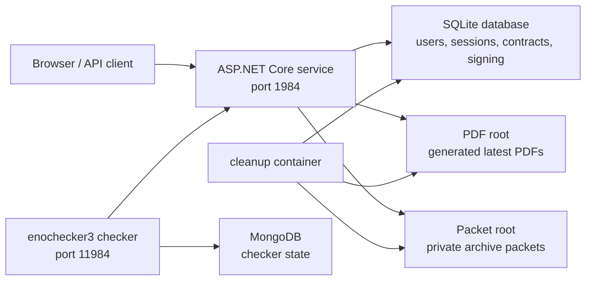

# Service Overview

SignMeMaybe models a contract office. A user logs in, files contracts, downloads generated PDFs, optionally stores a private archive packet with a contract, and creates signing authorities that can sign contracts through server-side ceremonies.

This documentation describes the `main` branch as the intentionally vulnerable A/D CTF version. The `fixed` branch contains the already implemented defended version with the fixes summarized in [`fixes.md`](fixes.md).

## Architecture



The service is a single .NET 10 application in `service/src`. It exposes both a browser UI and JSON/byte-oriented API endpoints. Runtime data is mounted below `/data` in Docker.

The checker is a Python `enochecker3` service in `checker/src/checker.py`. It creates users, stores checker state in MongoDB, verifies normal behavior, and contains reference exploit implementations for the three intentional vulnerabilities.

## Operational Disclaimer

During permanent setup and the ENOWARS A/D CTF, the service became unreliable under sustained high load and started to produce frequent checker mumbles. The current implementation includes persistence, cleanup, SQLite WAL mode, busy-timeout handling, and container resource limits, but these mitigations did not fully prevent load-related instability in the live environment.

Anyone reusing SignMeMaybe for another A/D CTF should plan a separate load test with the intended checker schedule, team count, retention window, and infrastructure limits. Treat the documented service behavior and vulnerabilities as the intended design, but treat heavy-load reliability as a known operational caveat.

## User Workflows

### Accounts And Sessions

Users register with `POST /api/register` and log in with `POST /api/login`. Both return a random session token. Authenticated API calls send that token as:

```http
X-Session-Token: <token>
```

`GET /api/me` verifies the current session.

### Contracts And PDFs

An authenticated user creates a contract with:

```http
POST /api/contracts
Content-Type: application/json
X-Session-Token: <token>

{
  "title": "Contract title",
  "content": "Contract body"
}
```

The service stores the contract in SQLite, creates a latest version, calculates a SHA-256 checksum over the content, and writes a generated PDF under `SIGNMEMAYBE_PDF_ROOT`.

Contract references normally have this deterministic form:

```text
CNTR-<first 24 lowercase hex chars of sha256(username + ":" + trimmedTitle + ":" + lowercaseChecksum)>
```

If the preferred reference already exists, the service falls back to a random `CNTR-...` reference.

Owners can list their contracts with `GET /api/contracts`. Any authenticated user can retrieve a latest version or PDF if they know a valid reference:

```http
GET /api/contracts/{reference}/versions/latest
GET /api/contracts/{reference}/versions/latest/pdf
```

That permissive behavior is intentional for vuln `0`.

### Archive Packets

A contract can include a private archive packet:

```json
{
  "title": "Certified Supplier Agreement",
  "content": "Public contract text",
  "archivePacket": "private packet bytes as UTF-8 text"
}
```

Archive packets are limited to 4096 bytes, written as files under `SIGNMEMAYBE_PACKET_ROOT`, and indexed in the `contract_packets` table. Owners retrieve the packet with:

```http
GET /api/contracts/{reference}/archive/packet
```

Public contract metadata does not expose the private packet bytes or the raw contract reference. It does expose `archiveTicket`, which is the public ticket used by the internal PDF worker route:

```http
GET /internal/archive/packets/{ticket}
X-SignMeMaybe-Pdf-Worker: annex-worker-v2
```

The internal route only answers loopback requests with the worker header. The interaction between public tickets, redirects, and the PDF annex fetcher is the basis of vuln `1`.

### Public Ledger

Anyone can query public contract metadata for a known username:

```http
GET /api/users/{username}/contracts
```

The response includes the canonical username, each public title, latest version number, approval state, checksum, creation timestamp, and optional `archiveTicket`. It intentionally omits `reference`.

### Signing Desk

Signing authorities hold an elliptic-curve private scalar and optional private signing note.

Important signing endpoints:

| Endpoint | Purpose |
| --- | --- |
| `GET /api/signing/curves` | List supported curve profiles |
| `POST /api/signing/authorities` | Create an owner-controlled signing authority |
| `GET /api/signing/authorities` | List the authenticated user's authorities |
| `GET /api/users/{username}/signing-authorities` | List public signing metadata for a user |
| `GET /api/signing/authorities/{authorityId}/secret` | Retrieve an owner-only signing note |
| `POST /api/signing/authorities/{authorityId}/ceremonies` | Create a signing ceremony for an owned contract |
| `GET /api/signing/ceremonies/{ceremonyId}` | Retrieve a ceremony visible to the requester or authority owner |
| `POST /api/signing/ceremonies/{ceremonyId}/validate` | Validate a receipt and mark the contract signed |

Public signing metadata includes `authorityId`, curve name, public key, and encrypted `secretBlob`. It does not expose the plaintext signing note. The off-curve base point issue in ceremony creation is vuln `2`.

## Storage Model

SQLite stores the relational state:

| Table | Role |
| --- | --- |
| `users` | Usernames and password hashes |
| `sessions` | Session tokens |
| `contracts` | Contract owners, titles, and public references |
| `contract_versions` | Latest content, checksums, PDF paths, approval state |
| `contract_packets` | Private archive packet paths and public tickets |
| `signing_authorities` | Signing keys, public metadata, encrypted note blobs |
| `signature_ceremonies` | Ceremony base points, signature points, receipt tags, validation state |
| `exports` | Export file bookkeeping for cleanup |

The schema also contains older annotation/comment/signature-request tables. They are not central to the checker flagstores.

Managed files live below these roots:

| Environment variable | Default | Content |
| --- | --- | --- |
| `SIGNMEMAYBE_DB_PATH` | `/data/signmemaybe.sqlite3` | SQLite database |
| `SIGNMEMAYBE_PDF_ROOT` | `/data/pdfs` | Generated PDFs |
| `SIGNMEMAYBE_EXPORT_ROOT` | `/data/exports` | Export files |
| `SIGNMEMAYBE_PACKET_ROOT` | `/data/packets` | Private archive packet files |

Other useful runtime options:

| Environment variable | Default | Meaning |
| --- | --- | --- |
| `SIGNMEMAYBE_MAX_UPLOAD_BYTES` | `10485760` | Maximum contract content size |
| `SIGNMEMAYBE_CLEANUP_RETENTION_SECONDS` | `720` | Age threshold for cleanup |
| `SIGNMEMAYBE_CLEANUP_SWEEP_FILES` | unset/false | Whether cleanup sweeps orphaned files |
| `SIGNMEMAYBE_PBKDF2_ITERATIONS` | service default unless set | Password hash iteration count |
| `SIGNMEMAYBE_SLOW_REQUEST_MS` | `1000` | Slow request logging threshold |

## Checker Behavior

The checker uses the username returned by `putflag` as the flag identifier. Exploit tasks recover that username from checker hints and then use public metadata to reach the correct flagstore.

Flagstore coverage:

| Checker action | Behavior |
| --- | --- |
| `putflag(0)` | Stores the flag in ordinary contract content and creates three decoy contracts |
| `getflag(0)` | Logs in as owner, verifies latest JSON/PDF, and checks public metadata exposes title/checksum but no reference |
| `putflag(1)` | Stores the flag as `archivePacket` on a harmless public contract |
| `getflag(1)` | Verifies owner-only packet retrieval and confirms JSON/PDF do not directly contain the packet |
| `putflag(2)` | Stores the flag as a private signing note on a P-256 authority |
| `getflag(2)` | Verifies owner-only note retrieval, public signing metadata, normal ceremony creation, and validation |
| `putnoise/getnoise` | Exercises normal account, contract, PDF, archive-packet, and signing workflows |
| `havoc` | Checks health endpoints, validation failures, auth boundaries, and cross-account ceremony permissions |
| `exploit(0..2)` | Contains reference exploit logic matching the documented vulnerabilities |

## Cleanup

`service/docker-compose.yml` starts both the main service and a `signmemaybe-cleanup` sidecar. The cleanup container runs once per minute and invokes:

```bash
dotnet /app/SignMeMaybe.dll --cleanup-once
```

Cleanup deletes old sessions, signature ceremonies, signing authorities, contracts, exports, generated PDFs, and archive packet files. It uses short SQLite busy timeouts and skips a tick successfully if the database is missing or locked.

Manual cleanup pass:

```bash
SIGNMEMAYBE_DB_PATH=/tmp/signmemaybe.sqlite3 \
SIGNMEMAYBE_PDF_ROOT=/tmp/signmemaybe-pdfs \
SIGNMEMAYBE_EXPORT_ROOT=/tmp/signmemaybe-exports \
SIGNMEMAYBE_PACKET_ROOT=/tmp/signmemaybe-packets \
SIGNMEMAYBE_CLEANUP_RETENTION_SECONDS=720 \
dotnet run --project service/src/SignMeMaybe.csproj -- --cleanup-once
```

## Running Locally

Service:

```bash
cd service
docker compose up --build
```

Checker:

```bash
cd checker
docker compose up --build
```

Local smoke commands:

```bash
curl -sS http://127.0.0.1:1984/health
curl -sS http://127.0.0.1:1984/api/info
curl -sS -X POST http://127.0.0.1:1984/api/register \
  -H 'Content-Type: application/json' \
  -d '{"username":"smoke_user","password":"password123"}'
```
